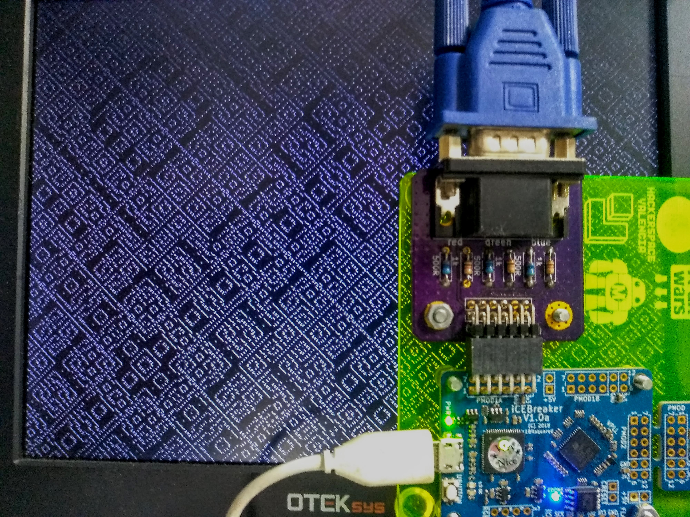
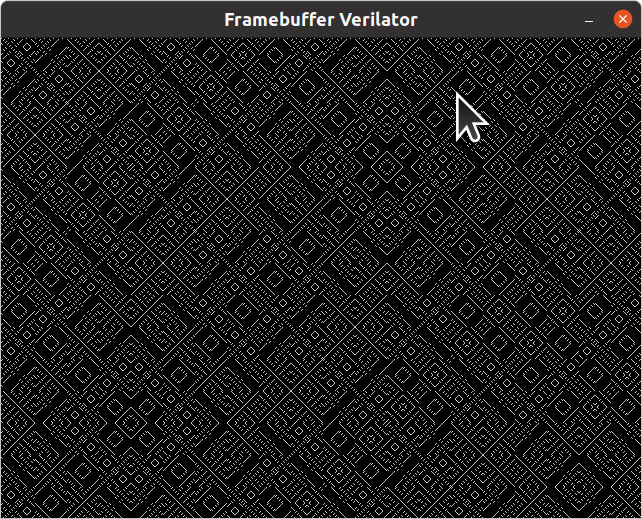

# XOR video fun on an FPGA

Saw this: https://hackaday.com/2021/04/13/alien-art-drawn-with-surprisingly-simple-math/

And made an FPGA implementation.

## Simulation instructions

Ensure that you have libsdl2-dev and verilator installed.

    sudo apt-get install libsdl2-dev libsdl2-image-dev verilator

To run the simulation use the following commands:

    cd rtl
    make verilator && ./obj_dir/Vxor

## FPGA Build instructions

It's setup to run on [1 Bit Squared icebreaker](https://1bitsquared.com/products/icebreaker) with my [VGA pmod](https://github.com/mattvenn/6bit-pmod-vga) plugged into pmod1a.

type

    make prog

to build & upload to the icebreaker

## License

This software and hardware is licensed under the [Apache License version 2](LICENSE-2.0.txt)
